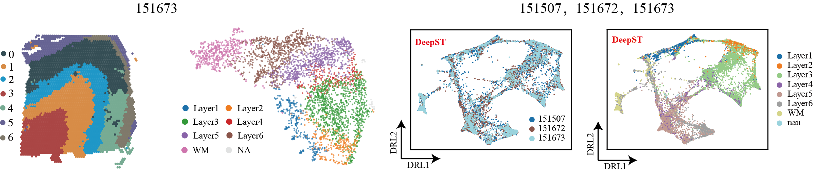

# DeepST: Identification of spatial domains in spatial transcriptomics by deep learning

## Overview
DeepST first uses H&E staining to extract tissue morphology information through a pre-trained deep learning model, and normalizes each spot’s gene expression according to the similarity of adjacent spots. DeepST further learns a spatial adjacency matrix on spatial location for the construction of graph convolutional network. DeepST uses a graph neural network autoencoder and a denoising autoencoder to jointly generate a latent representation of augmented ST data, while domain adversarial neural networks (DAN) are used to integrate ST data from multi-batches or different technologies. The output of DeepST can be applied to identify spatial domains, batch effect correction and downstream analysis.


## Package: `DeepST`

We created the python package called `DeepST` that uses [`scanpy`](https://scanpy.readthedocs.io/en/stable/) to streamline the integration of spatial transcriptomics datasets and
evaluate the results. DeepST is implemented in the open-source python using [`PyTorch`](https://pytorch.org/) and [`PyG`](https://github.com/pyg-team/pytorch_geometric) libraries.

### Installation
####Start by grabbing this source codes:
git clone https://github.com/spatial-Transcriptomics/DeepST.git
cd DeepST

####(Recommended) Using python virtual environment with [`conda`](https://anaconda.org/)

```bash
conda create -n deepst_env python=3.8
conda activate deepst_env
pip install -r requiements.txt
```
### Installing additional packages

<details>
  <summary> 1. Install PyTorch package </summary>
  
  + Installation via [Anaconda](https://anaconda.org/pyg/pyg).
```bash
conda install pytorch torchvision torchaudio cudatoolkit=10.2 -c pytorch
```
  + Installation via [Pip Wheels](https://pytorch-geometric.readthedocs.io/en/latest/notes/installation.html#installation-via-pip-wheels)
```bash
pip3 install torch torchvision torchaudio
```
</details>

<details>
  <summary> 2. Install PyG package </summary>
           
  + Installation via [Anaconda](https://anaconda.org/pyg/pyg).

You can now install PyG via Anaconda for all major OS/PyTorch/CUDA combinations 🤗 Given that you have [PyTorch >= 1.8.0](https://pytorch.org/get-started/locally/) installed, simply run:
```bash
conda install pyg -c pyg -c conda-forge
```
  + Installation via [Pip Wheels](https://pytorch-geometric.readthedocs.io/en/latest/notes/installation.html#installation-via-pip-wheels)

We have outsourced a lot of functionality of PyG to other packages, which needs to be installed in advance. These packages come with their own CPU and GPU kernel implementations based on the PyTorch C++/CUDA extension interface. We provide pip wheels for these packages for all major OS/PyTorch/CUDA combinations:
```bash
conda install pyg -c pyg -c conda-forge
```
1). Ensure that at least PyTorch 1.4.0 is installed:
```bash
python -c "import torch; print(torch.__version__)"
>>> 1.9.0
```
2). Find the CUDA version PyTorch was installed with:
```bash
python -c "import torch; print(torch.version.cuda)"
>>> 11.1
```
3). Install the relevant packages:
```bash
pip install torch-scatter -f https://data.pyg.org/whl/torch-${TORCH}+${CUDA}.html
pip install torch-sparse -f https://data.pyg.org/whl/torch-${TORCH}+${CUDA}.html
pip install torch-geometric

#### where ${CUDA} and ${TORCH} should be replaced by the specific CUDA version (cpu, cu92, cu101, cu102, cu110, cu111) and PyTorch version (1.4.0, 1.5.0, 1.6.0, 1.7.0, 1.7.1,  1.8.0, 1.8.1, 1.9.0, 1.9.1), respectively. For example, for PyTorch 1.9.0/1.9.1 and CUDA 11.1, type:
pip install torch-scatter -f https://data.pyg.org/whl/torch-1.9.0+cu111.html
pip install torch-sparse -f https://data.pyg.org/whl/torch-1.9.0+cu111.html
pip install torch-geometric

#### For PyTorch 1.8.0/1.8.1 and CUDA 10.2, type:
pip install torch-scatter -f https://data.pyg.org/whl/torch-1.8.0+cu102.html
pip install torch-sparse -f https://data.pyg.org/whl/torch-1.8.0+cu102.html
pip install torch-geometric
```
4). Install additional packages (optional):
To add additional functionality to PyG, such as k-NN and radius graph generation or SplineConv support, run
```bash
pip install torch-cluster -f https://data.pyg.org/whl/torch-${TORCH}+${CUDA}.html
pip install torch-spline-conv -f https://data.pyg.org/whl/torch-${TORCH}+${CUDA}.html
```
</details>


## Usage
DeepST is used on spatial transcriptomics (ST) datasets. In essence, you can refer to the following examples:
+ DeepST on DLPFC from 10x Visium.
```python
import os
from DeepST import run
data_path = './data/'
data_name = '151673' ###### if multiple datasets, just set data_name to list. data_name = ['151507','151672','151673']
save_path = './Results/'

H_mo = run(data_path=data_path, 
           data_name=data_name, 
           save_path=save_path, 
           platform='Visium',
           Conv_type='GCNConv',)
adata, stmap_feat = H_mo.fit()
H_mo.plot_clustering(adata, color='DeepST',img_key=None)
...
```

+ DeepST on ST data from other platforms.
```python
from DeepST import run
data_path = './data/'
data_name = 'MouseOlfactoryBulb' 
save_path = './Results/'

H_mo = run(data_path=data_path, 
           data_name=data_name, 
           save_path=save_path, 
           platform='Steroseq',  ####### eg: "MERFISH","SlideSeq" and "SeqFish"
           Conv_type='GCNConv',)
adata, stmap_feat = H_mo.fit()
H_mo.plot_clustering(adata, color='DeepST',img_key=None)
...
```
+ DeepST use different graph neural network (GNN) layer.
```python
from DeepST import run
data_path = './data/'
data_name = 'MouseOlfactoryBulb' 
save_path = './Results/'

H_mo = run(data_path=data_path, 
           data_name=data_name, 
           save_path=save_path, 
           platform='Steroseq',  
           Conv_type='GATConv',) ####### Based on PyG, you can select different GNN layer, such as GATConv, SAGEConv, et. 
adata, stmap_feat = H_mo.fit()
H_mo.plot_clustering(adata, color='DeepST',img_key=None)
...
```
## Compared tools
Tools that are compared include: 
* [BayesSpace](https://github.com/edward130603/BayesSpace)
* [stLearn](https://github.com/BiomedicalMachineLearning/stLearn)
* [SpaGCN](https://github.com/jianhuupenn/SpaGCN)
* [Seurat](https://satijalab.org/seurat/)
* [SEDR](https://github.com/JinmiaoChenLab/SEDR/)

### Download data
|      Platform      |       Tissue     |    SampleID   |
|:----------------:|:----------------:|:------------:|
| [10x Visium](https://support.10xgenomics.com) | Human dorsolateral pre-frontal cortex (DLPFC) | [151507,](https://spatial-dlpfc.s3.us-east-2.amazonaws.com/h5/151507_filtered_feature_bc_matrix.h5) [151508,](https://spatial-dlpfc.s3.us-east-2.amazonaws.com/h5/151508_filtered_feature_bc_matrix.h5) [151509,](https://spatial-dlpfc.s3.us-east-2.amazonaws.com/h5/151509_filtered_feature_bc_matrix.h5) [151510,](https://spatial-dlpfc.s3.us-east-2.amazonaws.com/h5/151510_filtered_feature_bc_matrix.h5) [151669,](https://spatial-dlpfc.s3.us-east-2.amazonaws.com/h5/151669_filtered_feature_bc_matrix.h5) [151670,](https://spatial-dlpfc.s3.us-east-2.amazonaws.com/h5/151570_filtered_feature_bc_matrix.h5) [151671,](https://spatial-dlpfc.s3.us-east-2.amazonaws.com/h5/151671_filtered_feature_bc_matrix.h5) [151672,](https://spatial-dlpfc.s3.us-east-2.amazonaws.com/h5/151672_filtered_feature_bc_matrix.h5) [151673,](https://spatial-dlpfc.s3.us-east-2.amazonaws.com/h5/151673_filtered_feature_bc_matrix.h5) [151674,](https://spatial-dlpfc.s3.us-east-2.amazonaws.com/h5/151674_filtered_feature_bc_matrix.h5) [151675,](https://spatial-dlpfc.s3.us-east-2.amazonaws.com/h5/151675_filtered_feature_bc_matrix.h5) [151676](https://spatial-dlpfc.s3.us-east-2.amazonaws.com/h5/151676_filtered_feature_bc_matrix.h5)
| [10x Visium](https://support.10xgenomics.com) | Mouse brain section| [Coronal,](https://www.10xgenomics.com/resources/datasets/mouse-kidney-section-coronal-1-standard-1-1-0) [Sagittal-Anterior,](https://www.10xgenomics.com/resources/datasets/mouse-brain-serial-section-1-sagittal-anterior-1-standard-1-1-0) [Sagittal-Posterior](https://www.10xgenomics.com/resources/datasets/mouse-brain-serial-section-1-sagittal-posterior-1-standard-1-1-0)
| [10x Visium](https://support.10xgenomics.com) | Human breast cancer| [Invasive Ductal Carcinoma breast,](https://www.10xgenomics.com/resources/datasets/human-breast-cancer-block-a-section-1-1-standard-1-1-0) [Ductal Carcinoma In Situ & Invasive Carcinoma](https://www.10xgenomics.com/resources/datasets/human-breast-cancer-ductal-carcinoma-in-situ-invasive-carcinoma-ffpe-1-standard-1-3-0) 
| [Stereo-Seq](https://www.biorxiv.org/content/10.1101/2021.01.17.427004v2) | Mouse olfactory bulb| [Olfactory bulb](https://github.com/BGIResearch/stereopy) 
| [Slide-seq](https://www.biorxiv.org/content/10.1101/2021.10.10.463829v1) |  Mouse hippocampus| [Coronal](https://www.spatialomics.org/SpatialDB/download/slideseq_30923225.tar.gz) 
| [MERFISH](https://www.pnas.org/content/116/39/19490) |  Mouse brain slice| [Hypothalamic preoptic region](https://www.spatialomics.org/SpatialDB/download/merfish_30385464.tar.gz) |

Spatial transcriptomics data of other platforms can be downloaded https://www.spatialomics.org/SpatialDB/
