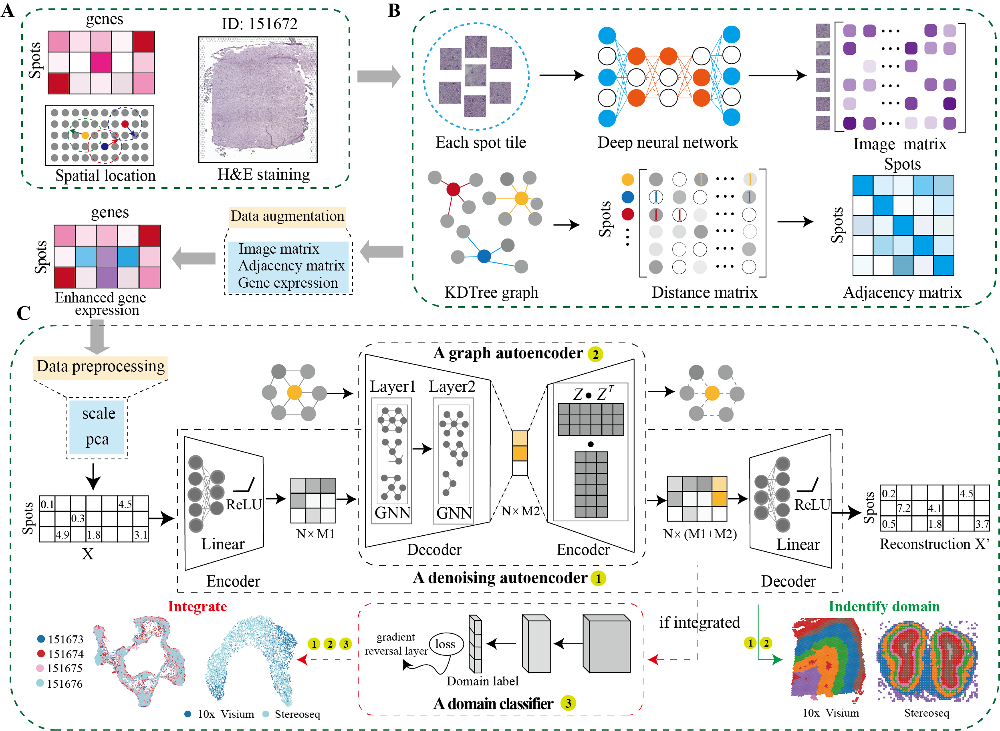

# DeepST: Identification of spatial domains in spatial transcriptomics by deep learning

## Overview
DeepST first uses H&E staining to extract tissue morphology information through a pre-trained deep learning model, and normalizes each spot’s gene expression according to the similarity of adjacent spots. DeepST further learns a spatial adjacency matrix on spatial location for the construction of graph convolutional network. DeepST uses a graph neural network autoencoder and a denoising autoencoder to jointly generate a latent representation of augmented ST data, while domain adversarial neural networks (DAN) are used to integrate ST data from multi-batches or different technologies. The output of DeepST can be applied to identify spatial domains, batch effect correction and downstream analysis.



## Package: `DeepST`

We created the python package called `DeepST` that uses [`scanpy`](https://scanpy.readthedocs.io/en/stable/) to streamline the integration of spatial transcriptomics datasets and
evaluate the results. DeepST is implemented in the open-source python using [`PyTorch`](https://pytorch.org/) and [`PyG`](https://github.com/pyg-team/pytorch_geometric) libraries.

### Installation
#### Start by grabbing this source codes:
```bash
git clone https://github.com/spatial-Transcriptomics/DeepST.git
cd DeepST
```

#### (Recommended) Using python virtual environment with [`conda`](https://anaconda.org/)

```bash
wget https://github.com/JiangBioLab/DeepST/archive/refs/heads/main.zip
unzip main.zip
cd /home/.../DeepST-main  ### your own path
conda create -n deepst_env python=3.9
conda activate deepst_env
## step1 Installing PyTorch’s CUDA support or CPU support on Linux
pip3 install torch==1.13.0+cu116 torchvision torchaudio --extra-index-url https://download.pytorch.org/whl/cu116  #### GPU
pip3 install torch==1.13.0 torchvision torchaudio --extra-index-url https://download.pytorch.org/whl/cpu  #### CPU
## step2 Installing PyG package. If unsuccessful, refer to the "Install PyG package".
pip install pyg_lib torch_scatter torch_sparse torch_cluster torch_spline_conv torch_geometric -f https://data.pyg.org/whl/torch-1.13.0+cu116.html #### GPU
pip install pyg_lib torch_scatter torch_sparse torch_cluster torch_spline_conv torch_geometric -f https://data.pyg.org/whl/torch-1.13.0+cpu.html  ### CPU
## step3 Download other dependencies
pip install -r requirements.txt
```
### Installing additional packages(optional)

<details>
  <summary> 1. Install PyTorch package </summary>
  
  + #### Installation via [Anaconda](https://anaconda.org/pyg/pyg).
```bash
conda install pytorch torchvision torchaudio cudatoolkit=10.2 -c pytorch
```
  + #### Installation via [Pip Wheels](https://pytorch-geometric.readthedocs.io/en/latest/notes/installation.html#installation-via-pip-wheels)
```bash
pip3 install torch torchvision torchaudio
```
</details>

<details>
  <summary> 2. Install PyG package </summary>
           
  + Installation via [Anaconda](https://anaconda.org/pyg/pyg).

You can now install PyG via Anaconda for all major OS/PyTorch/CUDA combinations 🤗 Given that you have [PyTorch >= 1.8.0](https://pytorch.org/get-started/locally/) installed, simply run:
```bash
conda install pyg -c pyg -c conda-forge
```
  + Installation via [Pip Wheels](https://pytorch-geometric.readthedocs.io/en/latest/notes/installation.html#installation-via-pip-wheels)

We have outsourced a lot of functionality of PyG to other packages, which needs to be installed in advance. These packages come with their own CPU and GPU kernel implementations based on the PyTorch C++/CUDA extension interface. We provide pip wheels for these packages for all major OS/PyTorch/CUDA combinations:
```bash
pip install pyg -c pyg -c conda-forge
```
1). Ensure that at least PyTorch 1.4.0 is installed:
```bash
python -c "import torch; print(torch.__version__)"
>>> 1.9.0
```
2). Find the CUDA version PyTorch was installed with:
```bash
python -c "import torch; print(torch.version.cuda)"
>>> 11.1
```
3). Install the relevant packages:
```bash
pip install torch-scatter -f https://data.pyg.org/whl/torch-${TORCH}+${CUDA}.html
pip install torch-sparse -f https://data.pyg.org/whl/torch-${TORCH}+${CUDA}.html
pip install torch-geometric

#### where ${CUDA} and ${TORCH} should be replaced by the specific CUDA version (cpu, cu92, cu101, cu102, cu110, cu111) and PyTorch version (1.4.0, 1.5.0, 1.6.0, 1.7.0, 1.7.1,  1.8.0, 1.8.1, 1.9.0, 1.9.1), respectively. For example, for PyTorch 1.9.0/1.9.1 and CUDA 11.1, type:
pip install torch-scatter -f https://data.pyg.org/whl/torch-1.9.0+cu111.html
pip install torch-sparse -f https://data.pyg.org/whl/torch-1.9.0+cu111.html
pip install torch-geometric

#### For PyTorch 1.8.0/1.8.1 and CUDA 10.2, type:
pip install torch-scatter -f https://data.pyg.org/whl/torch-1.8.0+cu102.html
pip install torch-sparse -f https://data.pyg.org/whl/torch-1.8.0+cu102.html
pip install torch-geometric
```
4). Install additional packages (optional):
To add additional functionality to PyG, such as k-NN and radius graph generation or SplineConv support, run
```bash
pip install torch-cluster -f https://data.pyg.org/whl/torch-${TORCH}+${CUDA}.html
pip install torch-spline-conv -f https://data.pyg.org/whl/torch-${TORCH}+${CUDA}.html
```
</details>

## Usage

July 10, 2023

(1) Due to the protocol issues of various space technology platforms, the data format is very different, and various platforms do not provide morphological images. For the convenience of users, we have changed the way of reading data to make it easier to use.

(2) Fixed bugs that appeared in the integration task.

(3) Expand the applicability of the model.

DeepST is used on spatial transcriptomics (ST) datasets. In essence, you can refer to the following examples:
+ #### DeepST on DLPFC from 10x Visium.
First, ``` cd /home/.../DeepST-main/deepst ```
```python
import os 
from DeepST import run
import matplotlib.pyplot as plt
from pathlib import Path
import scanpy as sc

data_path = "../data/DLPFC" #### to your path
data_name = '151673' #### project name
save_path = "../Results" #### save path
n_domains = 7 ###### the number of spatial domains.

deepen = run(save_path = save_path,
	task = "Identify_Domain", #### DeepST includes two tasks, one is "Identify_Domain" and the other is "Integration"
	pre_epochs = 800, ####  choose the number of training
	epochs = 1000, #### choose the number of training
	use_gpu = True)
###### Read in 10x Visium data, or user can read in themselves.
adata = deepen._get_adata(platform="Visium", data_path=data_path, data_name=data_name)
###### Segment the Morphological Image
adata = deepen._get_image_crop(adata, data_name=data_name) 

###### Data augmentation. spatial_type includes three kinds of "KDTree", "BallTree" and "LinearRegress", among which "LinearRegress"
###### is only applicable to 10x visium and the remaining omics selects the other two.
###### "use_morphological" defines whether to use morphological images.
adata = deepen._get_augment(adata, spatial_type="LinearRegress", use_morphological=True)

###### Build graphs. "distType" includes "KDTree", "BallTree", "kneighbors_graph", "Radius", etc., see adj.py
graph_dict = deepen._get_graph(adata.obsm["spatial"], distType = "BallTree")

###### Enhanced data preprocessing
data = deepen._data_process(adata, pca_n_comps = 200)

###### Training models
deepst_embed = deepen._fit(
		data = data,
		graph_dict = graph_dict,)
###### DeepST outputs
adata.obsm["DeepST_embed"] = deepst_embed

###### Define the number of space domains, and the model can also be customized. If it is a model custom priori = False.
adata = deepen._get_cluster_data(adata, n_domains=n_domains, priori = True)

###### Spatial localization map of the spatial domain
sc.pl.spatial(adata, color='DeepST_refine_domain', frameon = False, spot_size=150)
plt.savefig(os.path.join(save_path, f'{data_name}_domains.pdf'), bbox_inches='tight', dpi=300)
```
+ #### DeepST integrates data from mutil-batches or different technologies.
```python
import os 
from DeepST import run
import matplotlib.pyplot as plt
from pathlib import Path
import scanpy as sc

data_path = "../data/DLPFC" 
data_name_list = ['151673', '151674', '151675', '151676']
save_path = "../Results" 
n_domains = 7

deepen = run(save_path = save_path, 
	task = "Integration",
	pre_epochs = 800, 
	epochs = 1000, 
	use_gpu = True,
	)

###### Generate an augmented list of multiple datasets
augement_data_list = []
graph_list = []
for i in range(len(data_name_list)):
	adata = deepen._get_adata(platform="Visium", data_path=data_path, data_name=data_name_list[i])
	adata = deepen._get_image_crop(adata, data_name=data_name_list[i])
	adata = deepen._get_augment(adata, spatial_type="LinearRegress")
	graph_dict = deepen._get_graph(adata.obsm["spatial"], distType = "KDTree")
	augement_data_list.append(adata)
	graph_list.append(graph_dict)

######## Synthetic Datasets and Graphs
multiple_adata, multiple_graph = deepen._get_multiple_adata(adata_list = augement_data_list, data_name_list = data_name_list, graph_list = graph_list)

###### Enhanced data preprocessing
data = deepen._data_process(multiple_adata, pca_n_comps = 200)

deepst_embed = deepen._fit(
		data = data,
		graph_dict = multiple_graph,
		domains = multiple_adata.obs["batch"].values,  ##### Input to Domain Adversarial Model
		n_domains = len(data_name_list))
multiple_adata.obsm["DeepST_embed"] = deepst_embed
multiple_adata = deepen._get_cluster_data(multiple_adata, n_domains=n_domains, priori = True)

sc.pp.neighbors(multiple_adata, use_rep='DeepST_embed')
sc.tl.umap(multiple_adata)
sc.pl.umap(multiple_adata, color=["DeepST_refine_domain","batch_name"])
plt.savefig(os.path.join(save_path, f'{"_".join(data_name_list)}_umap.pdf'), bbox_inches='tight', dpi=300)

for data_name in data_name_list:
	adata = multiple_adata[multiple_adata.obs["batch_name"]==data_name]
	sc.pl.spatial(adata, color='DeepST_refine_domain', frameon = False, spot_size=150)
	plt.savefig(os.path.join(save_path, f'{data_name}_domains.pdf'), bbox_inches='tight', dpi=300)
```
+ #### DeepST works on other spatial omics data.
```python
import os 
from DeepST import run
import matplotlib.pyplot as plt
from pathlib import Path
import scanpy as sc

data_path = "../data" 
data_name = 'Stereoseq' 
save_path = "../Results" 
n_domains = 15 

deepen = run(save_path = save_path,
	task = "Identify_Domain", 
	pre_epochs = 800, 
	epochs = 1000, 
	use_gpu = True)
###### Read in other spatial data, or user can read in themselves. Including original expression
###### information and spatial location information, where the location information is saved in .obsm["spatial"]
adata = deepen._get_adata(platform="Stereoseq", data_path=data_path, data_name=data_name)

###### Data augmentation. spatial_type includes three kinds of "KDTree", "BallTree" and "LinearRegress", among which "LinearRegress"
###### is only applicable to 10x visium and the remaining omics selects the other two.
###### "use_morphological" defines whether to use morphological images.
adata = deepen._get_augment(adata, spatial_type="BallTree", use_morphological=False)

###### Build graphs. "distType" includes "KDTree", "BallTree", "kneighbors_graph", "Radius", etc., see adj.py
graph_dict = deepen._get_graph(adata.obsm["spatial"], distType = "BallTree")

###### Enhanced data preprocessing
data = deepen._data_process(adata, pca_n_comps = 200)

###### Training models
deepst_embed = deepen._fit(
		data = data,
		graph_dict = graph_dict,)
###### DeepST outputs
adata.obsm["DeepST_embed"] = deepst_embed

###### Define the number of space domains, and the model can also be customized. If it is a model custom priori = False.
adata = deepen._get_cluster_data(adata, n_domains=n_domains, priori = True)

###### Spatial localization map of the spatial domain
sc.pl.spatial(adata, color='DeepST_refine_domain', frameon = False, spot_size=150)
plt.savefig(os.path.join(save_path, f'{data_name}_domains.pdf'), bbox_inches='tight', dpi=300)
```
## Compared tools
Tools that are compared include: 
* [BayesSpace](https://github.com/edward130603/BayesSpace)
* [stLearn](https://github.com/BiomedicalMachineLearning/stLearn)
* [SpaGCN](https://github.com/jianhuupenn/SpaGCN)
* [Seurat](https://satijalab.org/seurat/)
* [SEDR](https://github.com/JinmiaoChenLab/SEDR/)

### Download data
|      Platform      |       Tissue     |    SampleID   |
|:----------------:|:----------------:|:------------:|
| [10x Visium](https://support.10xgenomics.com) | Human dorsolateral pre-frontal cortex (DLPFC) | [151507,](https://spatial-dlpfc.s3.us-east-2.amazonaws.com/h5/151507_filtered_feature_bc_matrix.h5) [151508,](https://spatial-dlpfc.s3.us-east-2.amazonaws.com/h5/151508_filtered_feature_bc_matrix.h5) [151509,](https://spatial-dlpfc.s3.us-east-2.amazonaws.com/h5/151509_filtered_feature_bc_matrix.h5) [151510,](https://spatial-dlpfc.s3.us-east-2.amazonaws.com/h5/151510_filtered_feature_bc_matrix.h5) [151669,](https://spatial-dlpfc.s3.us-east-2.amazonaws.com/h5/151669_filtered_feature_bc_matrix.h5) [151670,](https://spatial-dlpfc.s3.us-east-2.amazonaws.com/h5/151570_filtered_feature_bc_matrix.h5) [151671,](https://spatial-dlpfc.s3.us-east-2.amazonaws.com/h5/151671_filtered_feature_bc_matrix.h5) [151672,](https://spatial-dlpfc.s3.us-east-2.amazonaws.com/h5/151672_filtered_feature_bc_matrix.h5) [151673,](https://spatial-dlpfc.s3.us-east-2.amazonaws.com/h5/151673_filtered_feature_bc_matrix.h5) [151674,](https://spatial-dlpfc.s3.us-east-2.amazonaws.com/h5/151674_filtered_feature_bc_matrix.h5) [151675,](https://spatial-dlpfc.s3.us-east-2.amazonaws.com/h5/151675_filtered_feature_bc_matrix.h5) [151676](https://spatial-dlpfc.s3.us-east-2.amazonaws.com/h5/151676_filtered_feature_bc_matrix.h5)
| [10x Visium](https://support.10xgenomics.com) | Mouse brain section| [Coronal,](https://www.10xgenomics.com/resources/datasets/mouse-kidney-section-coronal-1-standard-1-1-0) [Sagittal-Anterior,](https://www.10xgenomics.com/resources/datasets/mouse-brain-serial-section-1-sagittal-anterior-1-standard-1-1-0) [Sagittal-Posterior](https://www.10xgenomics.com/resources/datasets/mouse-brain-serial-section-1-sagittal-posterior-1-standard-1-1-0)
| [10x Visium](https://support.10xgenomics.com) | Human breast cancer| [Invasive Ductal Carcinoma breast,](https://www.10xgenomics.com/resources/datasets/human-breast-cancer-block-a-section-1-1-standard-1-1-0) [Ductal Carcinoma In Situ & Invasive Carcinoma](https://www.10xgenomics.com/resources/datasets/human-breast-cancer-ductal-carcinoma-in-situ-invasive-carcinoma-ffpe-1-standard-1-3-0) 
| [Stereo-Seq](https://www.biorxiv.org/content/10.1101/2021.01.17.427004v2) | Mouse olfactory bulb| [Olfactory bulb](https://github.com/BGIResearch/stereopy) 
| [Slide-seq](https://www.biorxiv.org/content/10.1101/2021.10.10.463829v1) |  Mouse hippocampus| [Coronal](https://www.spatialomics.org/SpatialDB/download/slideseq_30923225.tar.gz) 
| [MERFISH](https://www.pnas.org/content/116/39/19490) |  Mouse brain slice| [Hypothalamic preoptic region](https://www.spatialomics.org/SpatialDB/download/merfish_30385464.tar.gz) |

Spatial transcriptomics data of other platforms can be downloaded https://www.spatialomics.org/SpatialDB/

### Contact
Feel free to submit an issue or contact us at xuchang0214@163.com for problems about the packages.
